# Part 1. ipcalc vositasi

## 1.1. Tarmoqlar va niqoblar

1 )  Tarmoq manzili 192.167.38.54/13  bu manzil haqida barcha malumotlarni olish uchun terminalda `ipcalc` vositasidan foydalandim.

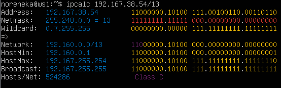
izoh: Tarmoq manzili va niqob ipcalc yordamida hisoblandi.

- 192.167.38.54/13 tarmoq manzili: **192.160.0.0**
- Niqob: **255.248.0.0** yoki **/13**
- Host oralig‘i: **192.160.0.1 – 192.167.255.254**
- Broadcast: **192.167.255.255**

2 )  255.255.255.0 niqobini prefiks va ikkilik yozuvga, /15 ni oddiy va ikkilik belgilarga aylantirish, 11111111.11111111.11111111.11110000 oddiy va prefiksda.

- IP mask: `255.255.255.0` ni ikkilikga o'tgazish uchun 2 bolib qoldiqni olamiz.\
255   = 11111111  
255   = 11111111  
255   = 11111111  
0     = 00000000

ikkilik: `11111111.11111111.11111111.00000000`
Nechta 1 borligini sanaymiz → 24 ta 1
Prefix: /24
Natija:
Binary: `11111111.11111111.11111111.00000000`
Prefix: `/24`
yoki `ipcalc`dan foydalanamiz terminalda buyruq: `ipacalc 255.255.255.0` 
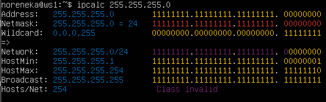
izox: `ipcalc` natijasi 

- `/15` \
terminal buyrugi `ipcalc 0.0.0.0/15`
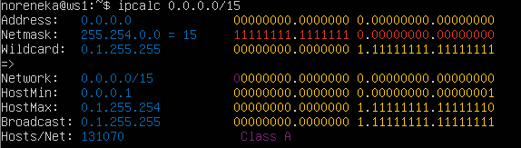
izox: Natija;\
- Decimal: 255.254.0.0
- Binary: 11111111.11111110.00000000.0000000 

- `11111111.11111111.11111111.11110000` oddiy va prefiksda.

Har bir qismni decimalga o‘tkazamiz:\
11111111 = 255

11111111 = 255

11111111 = 255

11110000 = 240

Decimal: `255.255.255.240`

Nechta 1 borligini sanaymiz:

`8 + 8 + 8 + 4 = 28 ta 1`\
`Prefix: /28`\
 Natija:\
`Decimal: 255.255.255.240`\
`Prefix: /28`

3 ) /8, 11111111.11111111.00000000.00000000, 255.255.254.0 va /4 niqoblarida 12.167.38.4 tarmog'idagi minimal va maksimal xost.
bu savolda ham `ipcalc`dan foydalanamiz.

buyruq 1: `ipcalc 12.167.38.4/8`\
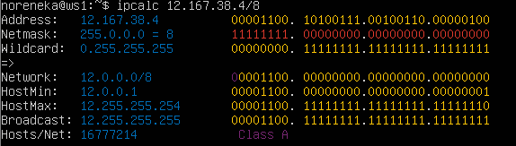
izox: `HostMin:   12.0.0.1`\
      `HostMax:   12.255.255.254` 

buyruq 2: `11111111.11111111.00000000.00000000 = 255.255.0.0=/16` \
`ipcalc 12.167.38.4/16`
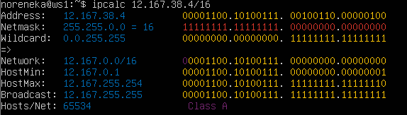
izox: `HostMin:   12.167.0.1`\
`HostMax:   12.167.255.254`

buyruq 3: `ipcalc 12.167.38.4/23`
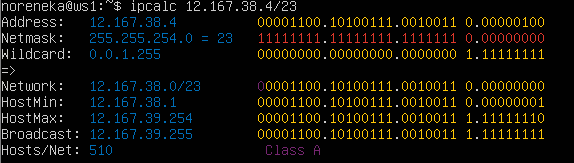
izox: `HostMin:   12.167.38.1` \
`HostMax:   12.167.39.254`
 
buyruq 4: `ipcalc 12.167.38.4/4` 
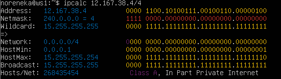
izox: `HostMin:   0.0.0.1`\
`HostMax:   15.255.255.254`

## 1.2. Localhost
Quyidagi IP manzillari bilan localhost-da ishlayotgan dastur bilan bog'lanish mumkinligini aniqlang va hisobotga yozing: 194.34.23.100, 127.0.0.2, 127.1.0.1, 128.0.0.1\
`localhost` nima?
`localhost` — bu kompyuterning o‘zini bildiradigan manzil.

Texnik jihatdan bu: `127.0.0.1`

`127.0.0.0/8` oralig‘i (ya’ni `127.0.0.0 dan 127.255.255.255` gacha) — faqat o‘z ichki aloqa (`loopback`) uchun ajratilgan.

💡 Demak, agar biror ilova `localhost`da ishlayotgan bo‘lsa, unga faqat `127.x.x.x` manzillari orqali kirish mumkin.

 Endi IP-larni tekshiramiz:

194.34.23.100 `Yo‘q`\
127.0.0.2	  `Ha`\
127.1.0.1	  `Ha`\
128.0.0.1	  `Yo‘q`

## 1.3. Tarmoqlar diapazonlari va segmentlari

1 ) IPv4 manzillari an'anaviy ravishda besh sinfga bo'lingan: A, B, C, D va E. Har bir sinf ma'lum bir diapazonga ega va turli maqsadlarda qo'llaniladi.
Xususiy (Private) IP manzil diapazonlari
Ba'zi IP manzil diapazonlari lokal tarmoqlarda foydalanish uchun ajratilgan va internetda to'g'ridan-to'g'ri marshrutlanmaydi. Bu manzillar quyidagilar:​

A sinfi: 10.0.0.0 dan 10.255.255.255 gacha​

B sinfi: 172.16.0.0 dan 172.31.255.255 gacha​

C sinfi: 192.168.0.0 dan 192.168.255.255 gacha

Bu manzillar odatda uy yoki ofis tarmoqlarida ishlatiladi va NAT (Network Address Translation) orqali internetga ulanadi. ​

Quyidagi IP manzillar orasida faqat quyidagilar private tarmoqlarda ishlatiladi:\

bular `private`:
-  `10.0.0.45` 
-  `192.168.4.2` 
-  `172.20.250.4` 
-  `172.16.255.255` 
-  `10.10.10.10` 
Qolganlar esa `public`:

 - `134.43.0.2` 
 - `172.0.2.1`
 -  `192.172.0.1` 
 -  `172.68.0.2` 
 -  `192.169.168.1` 

2 ) 10.10.0.0/18 tarmog‘ida quyidagi IP-manzillardan qaysilari shlyuz manzili bo‘lishi mumkin: 10.0.0.1, 10.10.0.2, 10.10.10.10, 10.10.100.1, 10.10.1.255

/18 prefiksni tushunamiz
/18 → bu 255.255.192.0 degani.
Bu tarmoqda birinchi 18 bit tarmoq, qolganlari host qismi:

10.10.0.0/18 → 10.10.0.0 dan boshlanadi

2⁶ host bit → 64 ta tarmoq bloklari, ya’ni:

10.10.0.0

10.10.0.1

…

10.10.63.255 — Broadcast manzil

Demak, quyidagi IP oralig‘i:`10.10.0.0 – 10.10.63.255`
Tarmoq: `10.10.0.0/18`  
(Maskasi: `255.255.192.0`, IP oraliq: `10.10.0.0 – 10.10.63.255`)

Quyidagi IP manzillardan tarmoq ichida joylashganlar:

-  `10.10.0.2` – Tarmoq ichida
-  `10.10.10.10` – Tarmoq ichida
-  `10.10.1.255` – Tarmoq ichida

Quyidagilar tarmoqdan tashqarida:

-  `10.0.0.1` – Tashqarida
-  `10.10.100.1` – Tashqarida

# Part 2. Ikki mashina o'rtasida statik marshrutizatsiya
### 1-ish 
\
Ikkita mashina ishga tushurildi(`ws1` va `ws2`)\
`ws1`ning tarmoq interfeysi:
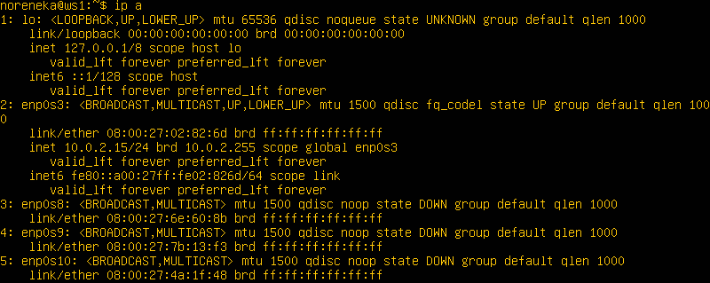
izox:tarmoq interfeysini korish uchun `ip a`dan foydalandim.\
`ws2`ning tarmoq interfeysi:
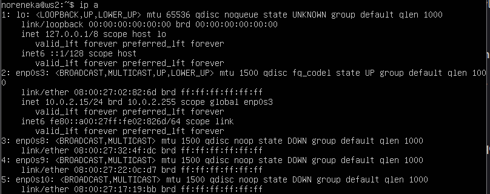
izox:tarmoq interfeysini korish uchun `ip a`dan foydalandim.

### 2-ish
`ws2`: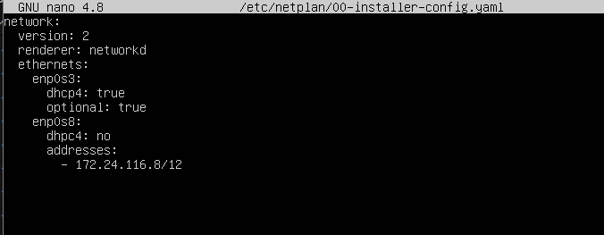
izox:sudo nano /etc/netplan/00-installer-config.yaml faylining mazmunini o'z ichiga olgan skrinshot.\
`ws1`: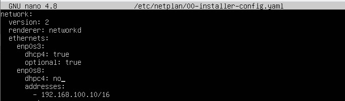
izox:sudo nano /etc/netplan/00-installer-config.yaml faylining mazmunini o'z ichiga olgan skrinshot.

### netplan application buyrug'ini ishga tushiring.

`ws1`:
izox:sudo netplan apply buyrugi bilan ishga tushuridi.\
`ws2`:
izox:sudo netplan apply buyrugi bilan ishga tushuridi.

### 2.1 Statik marshrutni qo'lda qo'shish

Qo‘lda marshrut qo‘shish (ip route add):
`WS1`:
sudo ip route add 172.16.0.0/12 via 192.168.100.10 dev enp0s8
\
`WS2`:
sudo ip route add 192.168.0.0/16 via 172.24.116.8 dev enp0s8 bu
buyruqlar orqali qolda qoshildi .
\
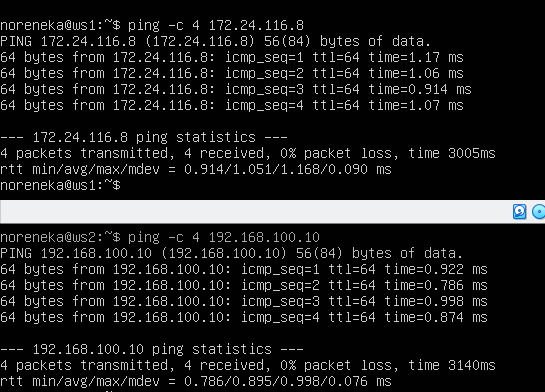
izox: Mashinalar orasidagi ulanishni ping qilindi.\

 - `sudo reboot` yordamida VM lar qayta ishga tushurildi va  Saqlash bilan statik marshrut qo'shildi:
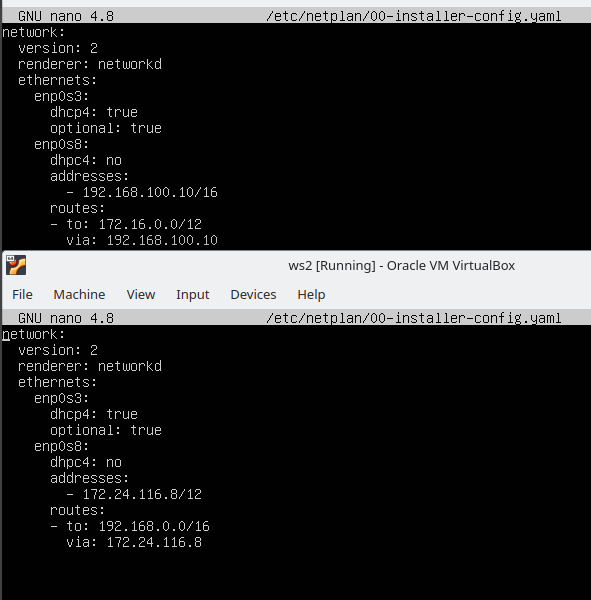
izox:  /etc/netplan/00-installer-config.yaml fayli tahrirlandi.\

- Mashinalar orasidagi ulanishni ping qilindi.

izox: ping natijasi ulanganligini korsatdi.

# Part 3.  iperf3 utilitasi

1. 8 Mbit/s ÷ 8 = 1 MB/s\
`Javob: 8 Mbit/s = 1 MB/s`\
2.1 MB/s = 1024 KB/s × 8 = 8192 Kbit/s
100 MB/s × 8192 = 819200 Kbit/s
`Javob: 819,200 Kbit/s`
3. 1 Gbit/s×1000=1000 Mbps\
`Javob: 1000 Mbps`

### 3.2. iperf3 utilitasi

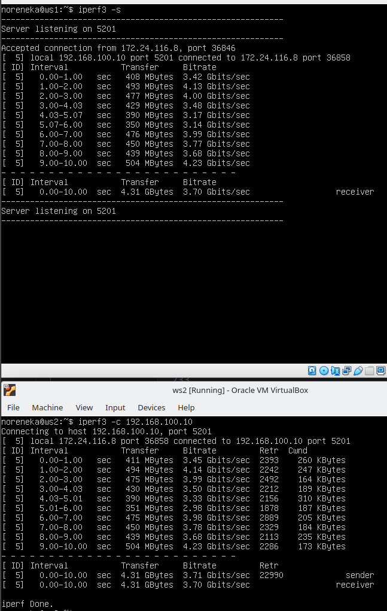
izox: Ws1 va ws2 o'rtasidagi ulanish tezligini o'lchandi.

# Part 4. Tarmoqli ekran

### 4.1. iptables utilitasi*
`sudo nano /etc/firewall.sh` buyrugi bilan fayl yaratildi.
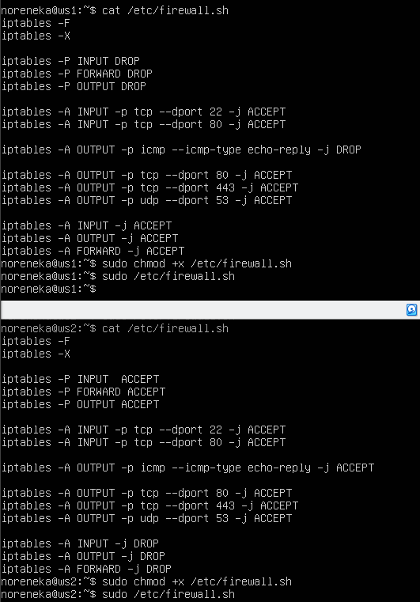
izox: ikkala mashinada `chmod +x /etc/firewall.sh` va `/etc/firewall.sh` buyruqlari bilan ishga tushurildi.
- Strategiyalar farqi:
`ws1`	Avval bloklab, keyin kerakli trafikni ruxsat beradi. Bu xavfsizroq yondashuv.\
`ws2`	Avval hamma trafik ruxsat etiladi, keyin faqat kerakmaslari bloklanadi. Tezroq, lekin xavfliroq.

### 4.2. nmap utilitasi

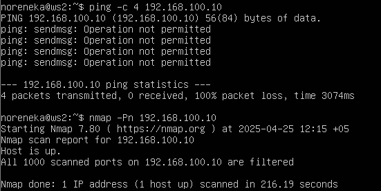
izox: `ping` va `nmap` tekshuruvi.\
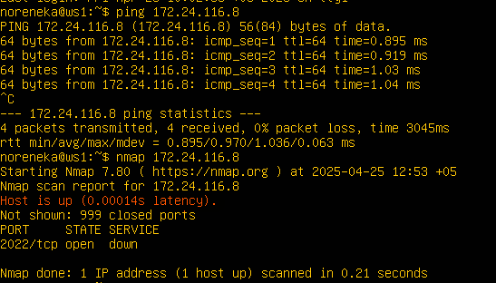
izox: `ping` va `nmap` tekshuruvi.

# Part 5. Tarmoqning static marshrutizatsiyasi
### 5.1. Mashina adreslarini sozlash

izox: Rasmdagi tarmoqqa muvofiq `etc/netplan/00-installer-config.yaml` da mashina konfiguratsiyasini sozlandi.\
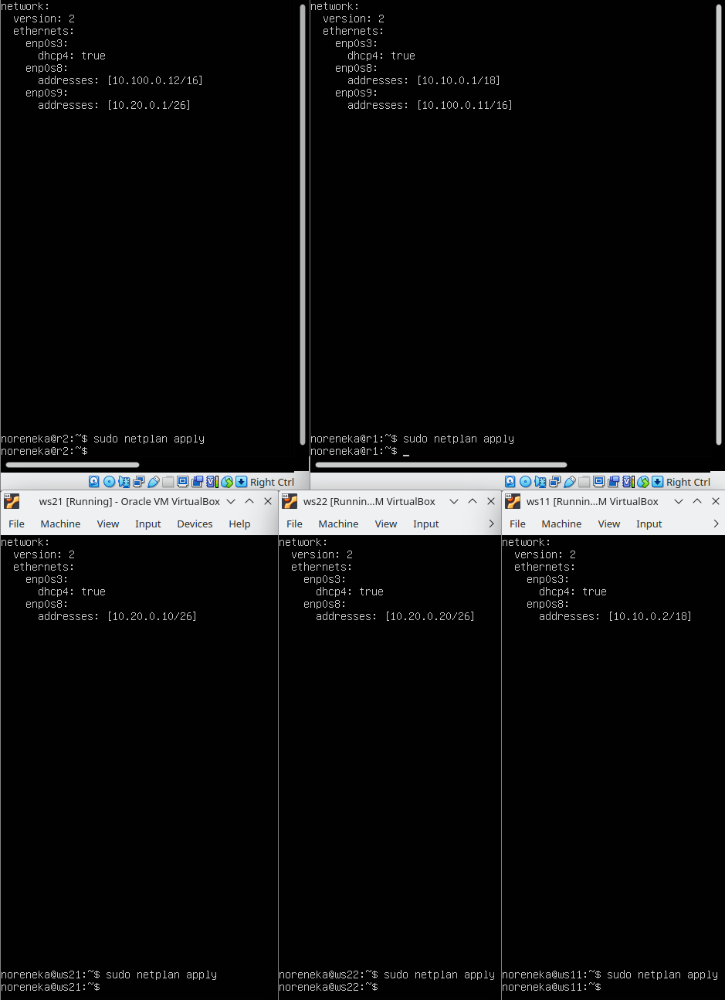
izox: har bir mashina uchun `etc/netplan/00-installer-config.yaml` faylining mazmuni bilan skrinshotlar.\

- 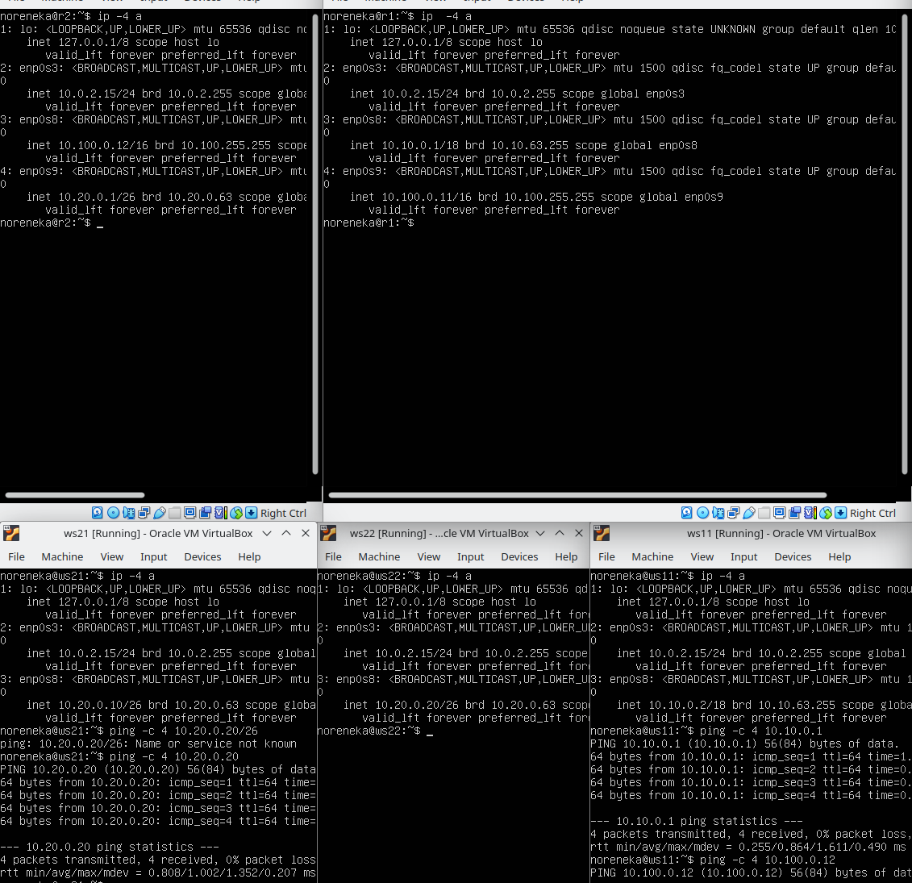
izox: `ip -4 a` va `ping` buyruqlari bajarildi.\

### 5.2. IP -manzillarning yo’naltirilishini yoqish

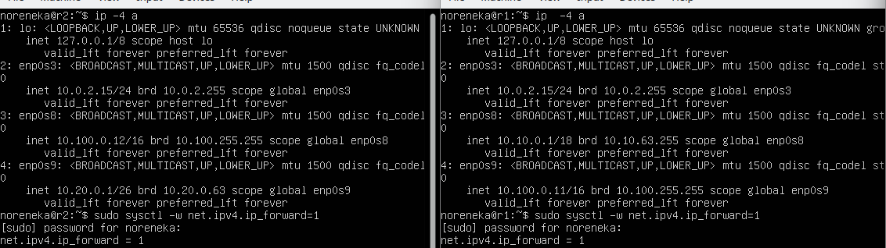
izox: Routerlar r1 va r2 da IP Forwarding yoqildi.

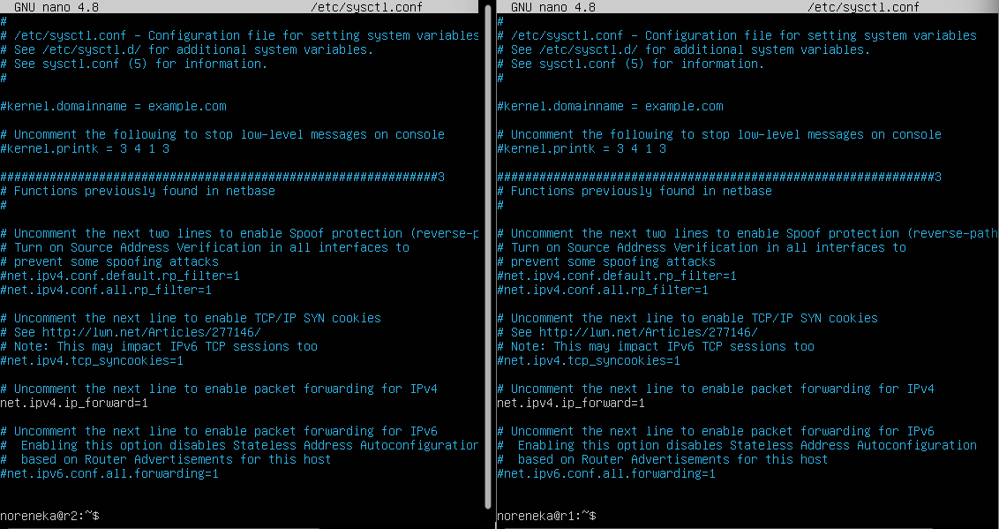
izox: `/etc/sysctl.conf` faylining mazmunini o'z ichiga olgan skrinshot.

### 5.3. marshrutni sozlash

- 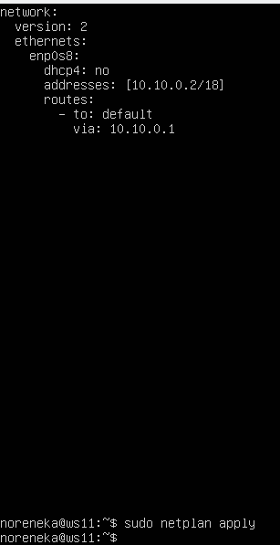
izox: etc/netplan/00-installer-config.yaml fayliga shlyuz sozlandi.\
- 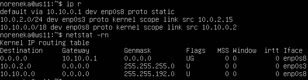
izox: mashrut qoshildi.
- 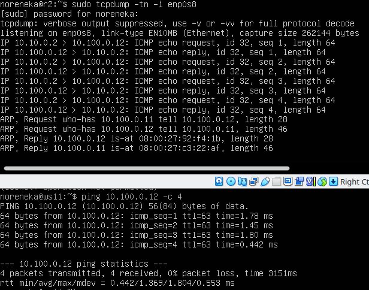 
izox: `ws11` dan ping router `r2` va ping qabul qilinayotganini `r2` ko'rsatildi.

### 5.4. Statik marshrutlarni qo’shish
- 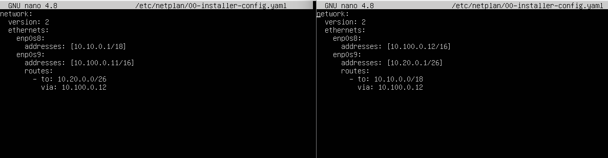
izox: Statik marshrutlarni qo’shildi.
- 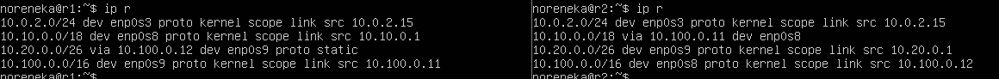
izox: mashrut jadvali.
- 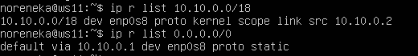
izox: `10.10.0.0/18` aniqroq marshrut bo‘lgani uchun, `WS11` dan `10.10.0.0/18` ichidagi IP-larga paket yuborilganda default marshrut `(0.0.0.0/0)` emas, balki `10.10.0.0/18 ` marshruti ishlatiladi.Chunki `/18` prefiksi `0.0.0.0/0` ga qaraganda ancha tor va aniqligi yuqori.

### 5.5. Marshrutizatorlar ro’yxatini qurish
- 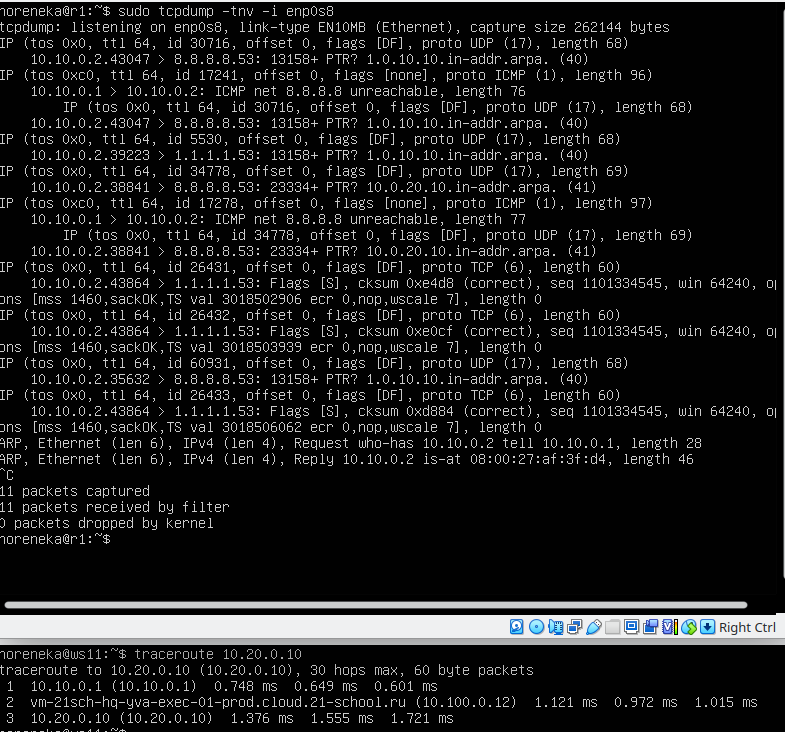
izox: `ws11` dan `ws21` gacha bo'lgan yo'lda marshrutizatorlar ro'yxati.
- Traceroute UDP paketlari yordamida har bir routerda qayta ishlash ketma-ketligini aniqlaydi. Bu jarayon 3 qadamdan iborat:

1. TTL=1 paket birinchi routerni (r1) aniqlaydi

2. TTL=2 paket ikkinchi routerni (r2) ko'rsatadi

3. TTL=3 paket maqsadli kompyuterga (ws21) yetadi
\
ICMP "net unreachable" xabarlari:
10.10.0.1 > 10.10.0.2: ICMP net 8.8.8.8 unreachable
Bu r1 routerining ws11 ga internetga chiqa olmasligi haqida xabar berayotganini ko'rsatadi (chunki 8.8.8.8 ga yo'l topilmagan).

DNS so'rovlari (UDP 53 portiga):
10.10.0.2.43047 > 8.8.8.8.53
ws11 DNS serverga so'rov yuborayotgani, lekin javob olmayapti (r1 internetga ulanishi yo'q yoki NAT sozlanmagan).

### 5.6. Marshrutlash uchun ICMP protokolidan foydalanish
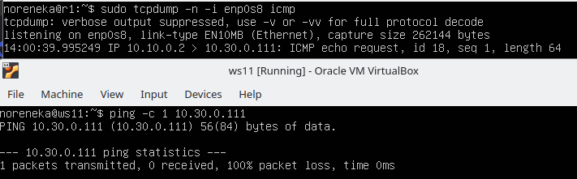
izox: `tcpdump -n -i eth0 icmp` va 
`ping -c 1 10.30.0.111` natijasi.

# Part 6. DHCP yordamida IP ni dinamik sozlash
1 ) 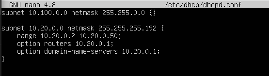
2 ) 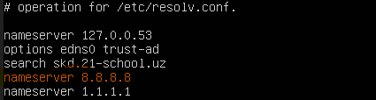
izox: fayllarning mazmuni o'zgartirildi.\

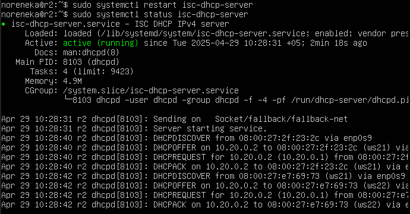
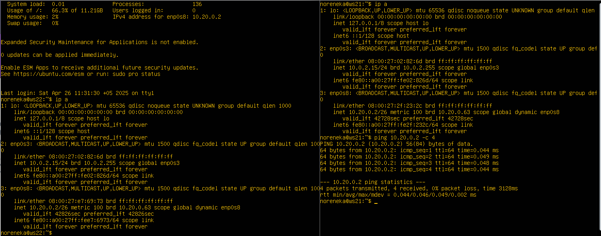
izox: `systemctl restart isc-dhcp-server` va `ip a` natijasi.\
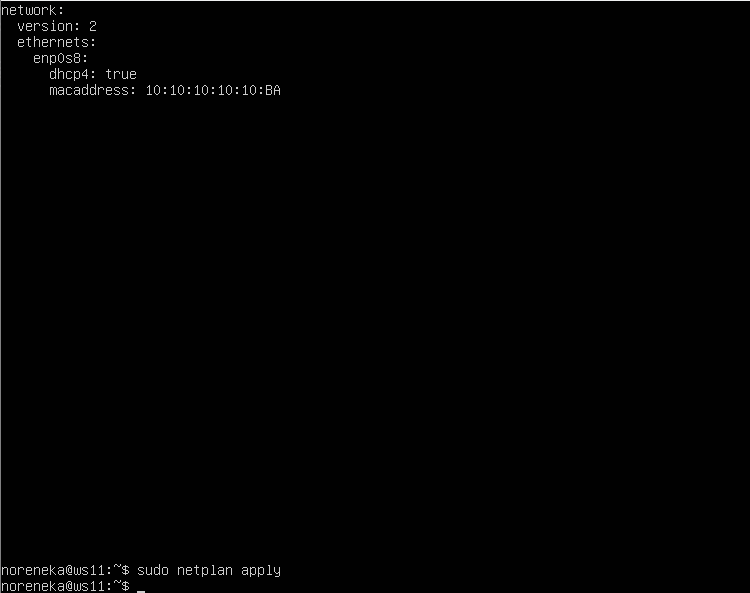
izox: ws11 uchun MAC manzilini belgilandi.\

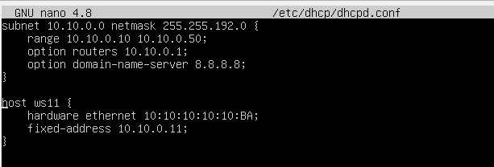
izox: `ws11` qat'iy bog'langan manzillarni berildi. \
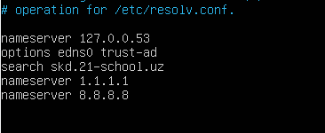
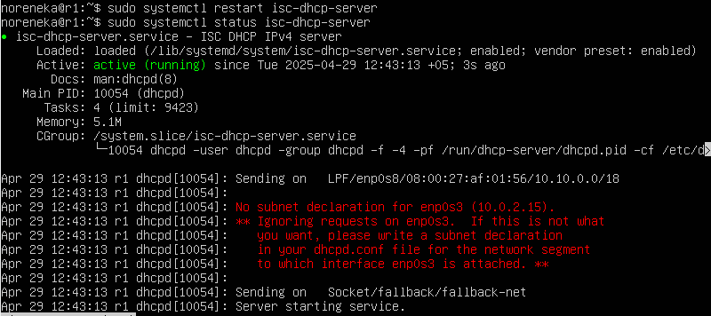
izox:r2 uchun sozlama bilan bir xil tarzda tavsiflandi. \

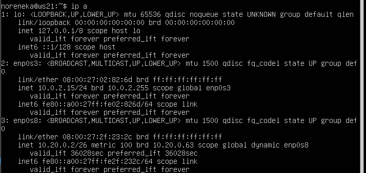
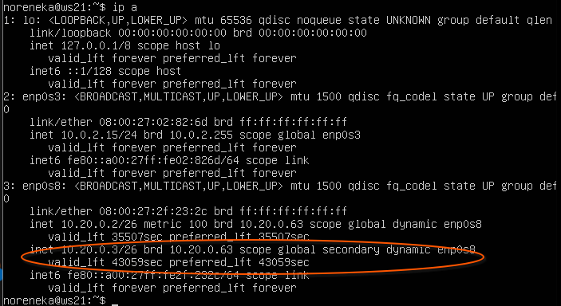
izox: yangilanishdan oldin va keyin IP skrinshotlar.\
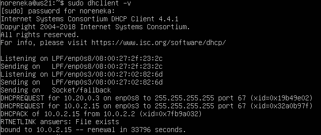
Bu yerda quyidagi DHCP parametrlar ishlatilgan:

- range: 10.10.0.10 dan 10.10.0.50 gacha bo‘lgan IP manzillar oralig‘i ws21 kabi qurilmalarga avtomatik tarzda taqsimlanadi.

- option routers: DHCP orqali tayinlangan qurilmalar uchun default gateway sifatida 10.10.0.1 ni belgilaydi.

- option domain-name-servers: DNS sifatida 8.8.8.8 (Google DNS) ko‘rsatilgan.

# Part 7. NAT

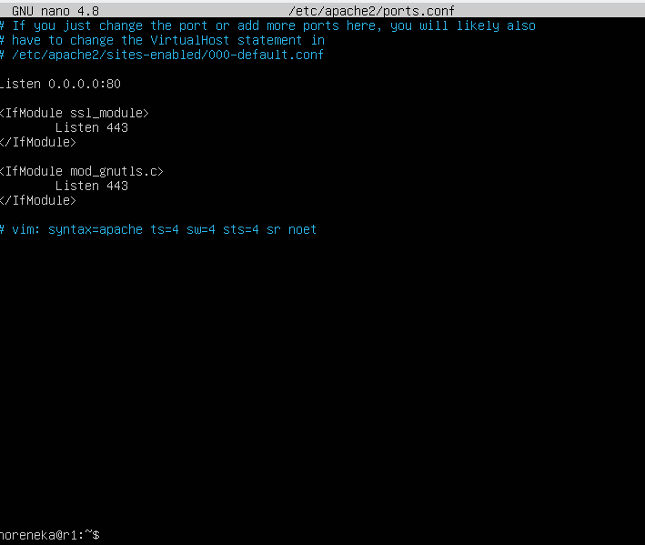
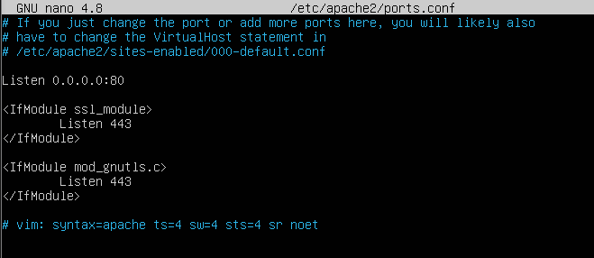
izox: Listen 80 qatorini Listen 0.0.0.0:80 ga o'zgartirildi.\
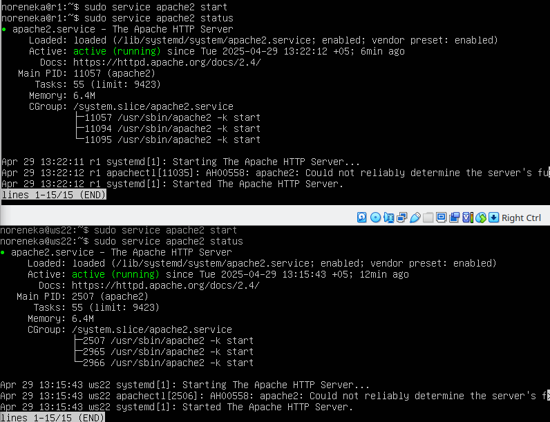
izox:ws22 va r1 da service apache2 start buyrug’I bilan Apache veb-serverini ishga tushirildi.\

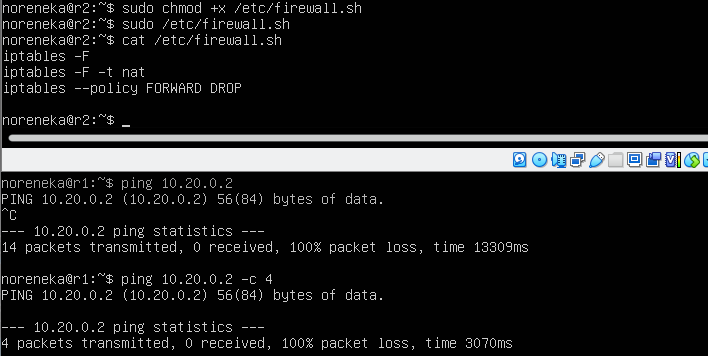
izox: `firewall` qoidalari va `ping` natijasi .\

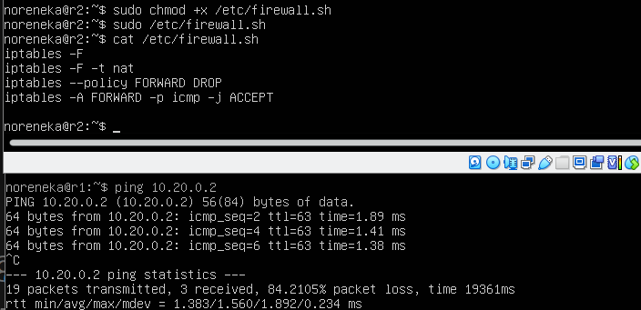
izox: `firewall` qoidalari va `ping` natijasi.\

- `SNAT va DNAT` qoidalar (5,6)\

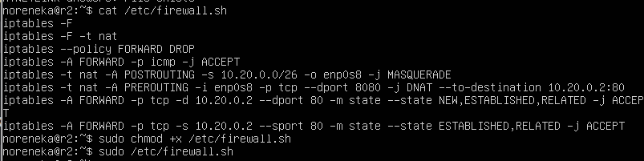
izox: firewall qoidalari\

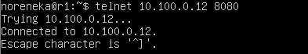
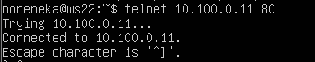
izox: `telnet` natijasi.

# Part 8. Qo'shimcha ravishda. SSH Tunnels bilan tanishish
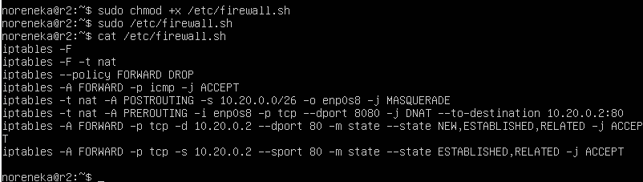
izox:xavfsizlik devorini ishga tushirildi.\
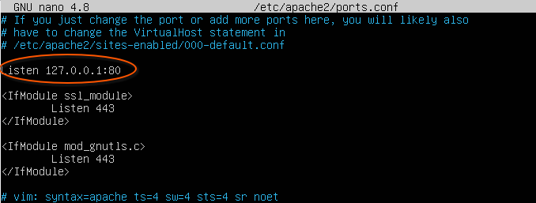
izox:  /etc/apache2/ports.conf faylida o'zgartirildi.\

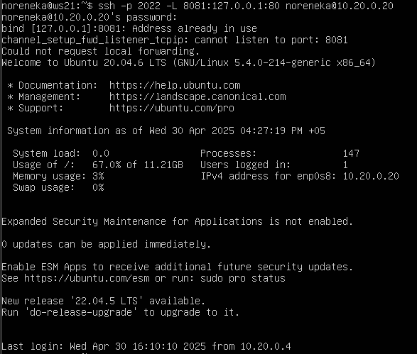
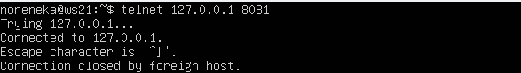
izox:ssh	Secure Shell orqali ulanish,-p 2022	WS22 da sshd xizmatining eshitayotgan porti — bu yerda 2022, -L 8081:127.0.0.1:80	WS21 kompyuteridagi 127.0.0.1:8081 ni WS22 dagi 127.0.0.1:80 bilan bog‘laydi, noreneka@10.20.0.20	WS22 foydalanuvchisi va IP manzili:
`telnet 127.0.0.1 8081`; telnet	TCP ulanishni qo‘l bilan sinovdan o‘tkazish uchun ishlatiladi, 127.0.0.1	WS21 dagi localhost, 8081	SSH orqali WS22 ga bog‘langan port\

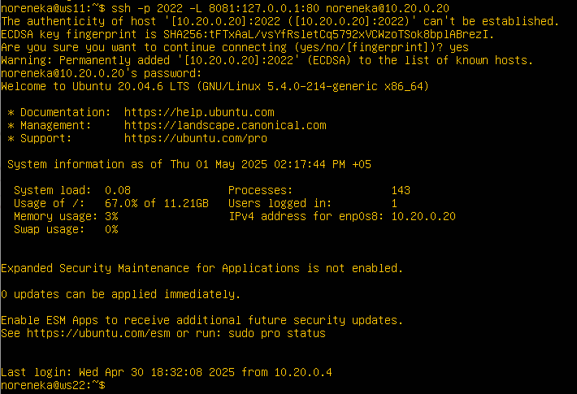
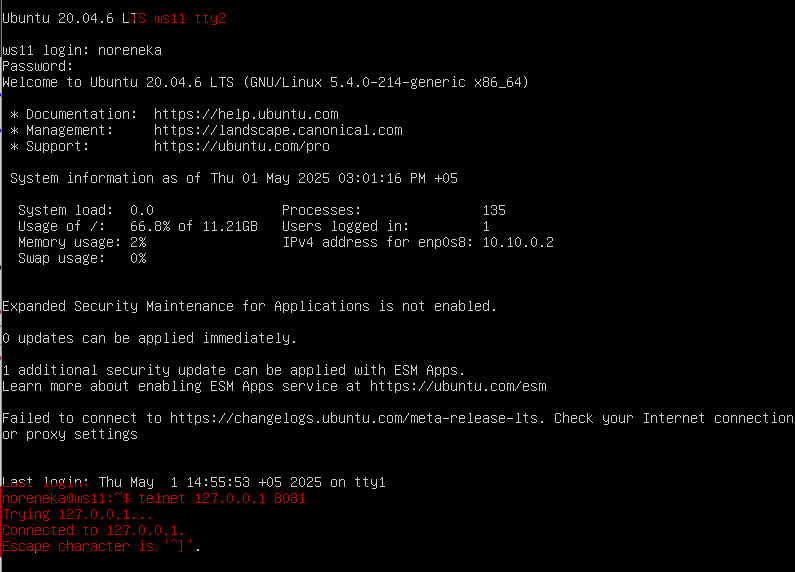
izox: ssh	Secure Shell orqali ulanish,-p 2022	WS22 da sshd xizmatining eshitayotgan porti — bu yerda 2022, -L 8081:127.0.0.1:80	WS21 kompyuteridagi 127.0.0.1:8081 ni WS22 dagi 127.0.0.1:80 bilan bog‘laydi, noreneka@10.20.0.20	WS22 foydalanuvchisi va IP manzili:
`telnet 127.0.0.1 8081`; telnet	TCP ulanishni qo‘l bilan sinovdan o‘tkazish uchun ishlatiladi, 127.0.0.1	WS21 dagi localhost, 8081	SSH orqali WS22 ga bog‘langan port.
